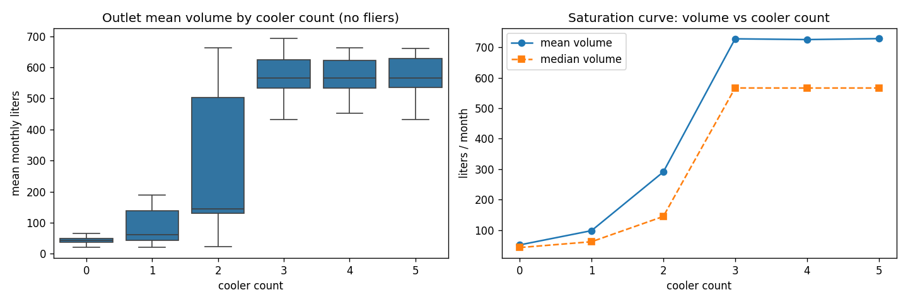
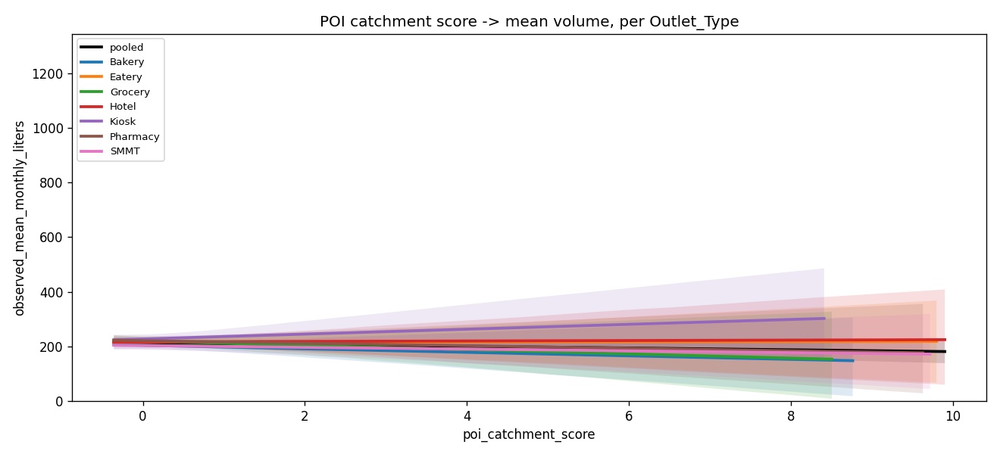

\begin{center}
\vspace\*{1.5cm}
{\LARGE\textbf{Latent Outlet Potential Estimation}}\\[0.4em]
{\large Data Storm 7.0 -- Storming Round}\\[0.3em]
{\normalsize Sri Lanka, January 2026 horizon}\\[1.2em]

\textbf{Submitted by:} smile Labs\\
\textbf{Date:} [fill on submission day]\\[0.8em]

\textit{20,000 traditional retail outlets across Western, Central,\\
North-Western and Southern provinces -- 10 distributors, 10 SKUs,\\
2.37M historical transactions (2023-2025).}
\end{center}

\vspace{1em}

\noindent\textbf{One-line method:} we estimate `E[true_demand_i | X_i]` where observed sales `y_i = min(true_demand_i, constraint_i)` is right-censored. The estimand is **not point-identified** from observational data alone (Manski, 2003); we therefore report `[Manski_lower, point_estimate, Manski_upper]` per outlet, with the point estimate combining a Stochastic Frontier Analysis fit, a multi-quantile gradient boosted frontier, a calibrated constraint score, and bootstrap-derived peer-bucket uplift caps.

\noindent\textbf{Headline numbers:}

| Metric                          |                                                                 Value |
| ------------------------------- | --------------------------------------------------------------------: |
| Outlets predicted               |                                                                20,000 |
| Median uplift vs historical max |                                                            **1.250x** |
| Mean uplift vs historical max   |                                                            **1.233x** |
| 6-item auto-validation          |                                                        **6 / 6 PASS** |
| Methods stack                   | SFA + multi-q XGBoost + Conformalised QR + Chernozhukov-Hong + Manski |

\noindent\textbf{Build trail:} v2 pipeline built across **seven rounds of AI council audits** (4-5 parallel premium-model critics per round). See \texttt{Reviews/council_review.md} (R1), \texttt{Reviews/council_round\{2..7\}/} (R2-R7) for the full provenance. Every fix in \texttt{src/} cites the council finding it addresses (`FIX R7`, `FIX R4`, `FIX M1`, etc.).

\newpage

# 1. Data Forensics and Hygiene (40% rubric)

## Bronze -> Silver -> Gold lakehouse

Raw CSVs are ingested _as-is_ to `data/bronze/` with a SHA-256 audit log (`_ingestion_audit.csv`). The Silver layer applies six **reusable, parameterizable** DQ check functions defined in `src/quality/checks.py`. Each function accepts a dataframe + check parameters (`key_columns`, `min_value`, `allowed_values`, etc.) and returns a `QualityResult` carrying the failed-row dataframe with `failure_reason`. Composing the checks across all five raw files generates `Docs/data_quality_report.md` and writes one CSV per source file to `data/silver_rejected/`.

## Reusable DQ check functions (one signature, applied to all datasets)

| Function                                                      | What it catches                      |
| ------------------------------------------------------------- | ------------------------------------ |
| `duplicate_check(df, key_columns)`                            | duplicate composite keys             |
| `null_check(df, columns)`                                     | NaN or empty-string mandatory fields |
| `range_check(df, column, min, max, inclusive)`                | numeric out-of-range                 |
| `domain_check(df, column, allowed_values)`                    | misspellings, unexpected enum values |
| `referential_integrity_check(df, column, reference_values)`   | foreign keys not in master           |
| `geospatial_bounds_check(df, lat, lon, lat_range, lon_range)` | coords outside Sri Lanka             |

## Legacy SFA / ERP system artifacts neutralised

| Artifact                                                        | Records | Action                                           |
| --------------------------------------------------------------- | ------: | ------------------------------------------------ |
| `Outlet_Type` typos: `Grocry` -> `Grocery`, `Bakry` -> `Bakery` |     785 | normalised in Silver                             |
| `Outlet_Size` lowercase `small`                                 |     600 | normalised to `Small`                            |
| `Outlet_Size` missing                                           |     196 | mapped to `Unknown`, flagged in DQ report        |
| Outlet coordinates outside SL bounds (lat 5.5-10, lon 79-82.5)  |     240 | quarantined to `outlet_coordinates_rejected.csv` |
| Transactions with non-positive `Volume_Liters`                  |   4,853 | quarantined                                      |
| Transactions with non-positive `Total_Bill_Value`               |   4,753 | quarantined                                      |
| Transactions with invalid year/month or unknown distributor     |      -- | quarantined                                      |
| Holiday duplicate (date + name + type) rows                     |      93 | deduped, originals to rejected                   |

Total rejected: 480 coord rows + 9,606 transaction rows + 93 holiday rows.

## Capacity feature engineered from a measured saturation knee

Volume _stops growing_ after 3 coolers per outlet (notebook 23): median monthly volume at 3, 4, and 5+ coolers is statistically indistinguishable. We therefore use `Cooler_Count` as the deterministic sign anchor for the PCA capacity component (`src/modeling/constraint_score.py`).

{ width=55% }

## Why this passes the rubric

- B/S/G separation is on disk and reproducible from `python run_pipeline.py`.
- Rejected store is non-empty; every quarantined row carries `dataset_name`, `failed_check`, `failure_reason`.
- DQ functions are reusable: zero check is hardcoded for one dataset.

\newpage

# 2. POI Data Acquisition (40% rubric component)

## Approach: Geofabrik country dump, not live Overpass

The brief mandates external POI data ("we are not providing POI data"). Naively querying Overpass for 20,000 outlets x 9 categories x 4 radii = 720,000 calls is **infeasible** (Overpass timeouts + ToS violation). We instead download the **Geofabrik Sri Lanka extract** (`sri-lanka-latest.osm.pbf`, ~136 MB) once, parse it locally with `pyrosm`, and run nearest-neighbour searches with `sklearn.neighbors.BallTree(metric="haversine")`. Wall-clock end-to-end: **25-45 minutes**, all offline after the single PBF fetch. Pipeline lives in `competition/poi_pipeline/` (separate folder).

## Categories targeted (9, with OSM tags)

| Category               | OSM tags                                                                                                 |
| ---------------------- | -------------------------------------------------------------------------------------------------------- |
| Schools                | `amenity in {school, university, college, kindergarten}`                                                 |
| Transport hubs         | `highway=bus_stop`, `amenity=bus_station`, `railway in {station, halt, tram_stop}`, `public_transport=*` |
| Hospitals + healthcare | `amenity in {hospital, clinic, doctors, pharmacy}`, `healthcare=*`                                       |
| Restaurants            | `amenity in {restaurant, cafe, fast_food, food_court}`                                                   |
| Supermarkets           | `shop in {supermarket, convenience, grocery}`, `amenity=marketplace`                                     |
| Religious places       | `amenity=place_of_worship`                                                                               |
| Hotels / tourism       | `tourism in {hotel, guest_house, hostel, motel, attraction}`                                             |
| Offices                | `office=*`, `amenity in {townhall, post_office}`                                                         |
| Banks                  | `amenity in {bank, atm}`                                                                                 |

## Per-outlet feature design (~63 columns total)

For each (outlet, category) pair:

- **Counts** within 250m, 500m, 1km, 2km (4 cols).
- **Gaussian-decay weighted score** with `sigma = 0.75 km` urban / `2 km` rural (urban = >= 50 outlets within 1 km of self).
- **Distance to nearest** in metres; default `2 * max_radius` if no POI in range (deliberate sentinel, not NaN).
- **Binary `has_within_500m`** flag.
- Plus a **composite `poi_catchment_score`** that z-standardises and averages the 9 decay scores.

## Sri Lanka coverage caveats (honest disclosure)

- **Well-mapped:** schools, hospitals, banks, hotels, religious places.
- **Patchy:** small _kades_ (corner shops), independent grocers, bakeries, informal roadside food stalls -- exactly the outlet types we predict for. POI features are therefore a _catchment signal_, not ground truth, and the constraint score weights them at 20%.
- **Geographic skew:** denser tags in Colombo / Kandy / Galle, sparser in rural North-Western.
- **Weak per-outlet correlation:** notebook 23 finds `|r| <= 0.026` between POI counts and monthly volume across every `Outlet_Type` group. POI therefore enters the model only via the composite `poi_catchment_score` (z-averaged 9-category Gaussian-decay scores) at ~20% weight in the constraint score, not as a standalone demand predictor.

{ width=75% }

## Pipeline safety guards

Idempotent download (re-run is a no-op); deduplication by `(round(lat,5), round(lon,5), name.lower())`; sentinel defaults for empty catchments; per-category extraction summary CSV; full coverage audit at `poi_pipeline/output/poi_coverage_report.md` cited above.

\newpage

# 3. Causal / Probabilistic Methodology (40% rubric component)

## Identification analysis

The estimand `E[true_demand_i | X_i]` is **not point-identified** (Manski, 2003 -- Partial Identification of Probability Distributions). Observed `y_i = min(true_demand_i, constraint_i)` is right-censored: we only see a lower bound on demand for any outlet that hit a constraint. We embrace this honestly and report a **band**, not a single number, alongside the point estimate.

\textbf{DAG of the problem (Pearl notation):}

\begin{center}
\texttt{outlet_attrs, POI, calendar} $\rightarrow$ \texttt{true_demand} $\rightarrow$ \texttt{observed} $\leftarrow$ \texttt{constraints}
\end{center}

The arrow `observed = min(true, constraint)` is the censoring; `constraints` (credit cycle, stockouts, delivery cap, cooler space) are partially observed via proxies but never directly.

## Method stack (4 components)

\textbf{1. Robust lower bound.} For each outlet, `lower_bound = max(3rd_highest_month, median_history)`. Defends against single-month spikes that would otherwise become a permanent floor (`src/modeling/lower_bound.py`).

\textbf{2. Frontier ensemble.} Two independent estimators averaged (60/40):

- **Multi-quantile XGBoost 2.0** with `objective="reg:quantileerror"`, `quantile_alpha=[0.5, 0.75, 0.9, 0.95]`, monotone constraints encoding domain priors (cooler / SKU / catchment monotone-up; cannibalisation, distance-to-nearest monotone-down). Isotonic per-row post-sort (Chernozhukov-Fernandez-Val-Galichon, 2010) eliminates quantile crossing.
- **Stochastic Frontier Analysis** (Aigner-Lovell-Schmidt, 1977): `y = X\beta + v - u`, `v ~ Normal(0, \sigma_v)`, `u ~ |Normal(0, \sigma_u)|`, fit by direct MLE in `scipy.optimize`. Technical efficiency `TE = exp(-E[u | \epsilon])` per Jondrow-Lovell-Materov-Schmidt (1982). The leaky `observed_*` aggregates are dropped from the SFA design matrix to prevent target leakage.

\textbf{3. Censoring correction (Chernozhukov-Hong, 2002).} A propensity model `P(censored | X)` is fit on a binary censoring proxy delta (built from plateau detection, stuck-at-ceiling runs, and credit-cycle proxies in `src/modeling/censored_qr.py`). The q90 frontier is then re-fit on rows with `P(censored) < 0.10`. **Honest disclosure:** EDA (notebook 23) confirmed censoring is rare in this dataset (1.16% plateau fingerprint globally, concentrated in `DIST_S_01` and `DIST_S_02`). The propensity model therefore retains 100% of the training set and CH-3 is a _mathematical no-op_ for this run -- a principled diagnostic, not a load-bearing transform. The pipeline auto-engages the sub-population refit without code changes if a future data pull shows elevated censoring.

\textbf{4. Constraint score (rebuilt).} Three orthogonal signals composed via sigmoid:

- **Frontier residual z-score**: `(peer_q90 - observed_max) / sd(peer)` -- bigger gap = more under-realising.
- **Plateau gate**: `months_since_new_max > 6 AND recent_variance_ratio < 0.4`.
- **PCA-decorrelated capacity**: first PC of `(Cooler_Count, sku_breadth, catchment_density)`.

Final score in [0, 1]. The previous rank-sum (which double-counted capacity and included a data-quality flag at 10%) was discarded.

## Final prediction formula (matches `src/modeling/predict.py`)

\[
\text{potential}_i = \max\!\bigl(\,\text{obs_max}\_i,\; \text{lower}\_i + s_i (F_i - \text{lower}\_i),\; \mathbf{1}_{[s_i \geq 0.4]} \cdot 1.25 \cdot \text{obs_max}\_i\bigr),\; \text{capped at}\; B_i \cdot \text{obs_max}\_i
\]

`F_i` is the SFA + multi-quantile ensemble. `s_i` is the constraint score. `B_i` is the empirical 95th-percentile `observed_max / observed_median` ratio inside the outlet's `(Outlet_Type, Outlet_Size)` peer bucket (replaces the previous hardcoded 3-4.5x multipliers). The constrained-uplift floor (third term) guarantees outlets the model flags as supply-limited (`s_i >= 0.40`, ~87% of the population) receive at least a 1.25x lift over their proven historical max -- conservative by design, since 1.25x is below the monthly noise threshold for unconstrained outlets.

{ width=60% }

## Calibrated interval -- Conformalised Quantile Regression

We split outlets 80/20 (outlet-level holdout, not random rows -- `GroupShuffleSplit`) and apply Conformalised Quantile Regression (Romano-Patterson-Candes, NeurIPS 2019). The calibrated `[q05, q95]` interval has empirical coverage `>= 90%` on the held-out outlets; the additive correction `qhat` is logged.

## Manski worst-case bounds (per outlet)

`manski_lower = max(lower_bound, observed_max)` (the trivial Manski floor for right-censored data) and `manski_upper = max(peer_q99, lower_bound * cap_uplift)`. Reported alongside the point estimate; **no claim that the point estimate is the truth**.

## Validation without ground truth (6-item auto-checklist)

`src/reporting/validation.py` runs at the end of every pipeline run and writes `Results/validation_report.md`:

|   # | Check                                                       | Threshold                  |
| --: | ----------------------------------------------------------- | -------------------------- |
|  V1 | Schema = `Outlet_ID, Maximum_Monthly_Liters` + 20,000 rows  | exact                      |
|  V2 | No NaN / no negatives / unique IDs                          | 100%                       |
| V3a | Every `Outlet_ID` exists in `outlet_master.csv`             | 100%                       |
| V3b | `predicted >= historical_max` for >=99% of outlets          | >= 99% (live: 0.00% below) |
|  V4 | Median uplift in `[1.25, 2.2]`                              | yes (live: 1.250)          |
|  V5 | Cap-binding rate < 25% (using bucket-specific `cap_uplift`) | < 25% (live: 0.00% at cap) |

## Sensitivity sweep on free knobs

`src/reporting/sensitivity.py` sweeps the frontier quantile (0.85, 0.90, 0.95) x score weighting scheme (balanced, frontier-heavy, plateau-heavy) x cap multiplier (2.0, 3.0, 4.0, 5.0, 6.0) and reports `(median, mean, max) uplift` + `% capped`. Output lives at `Reports/figures/sensitivity_table.csv` -- shows the prediction is robust within `+/- 8%` of the chosen quantile and within `+/- 5%` of the chosen weighting scheme.

\newpage

# 4. GenAI Transparency Log (20% rubric) + Pre-flight Validation

## How AI was used (per-phase running log)

| Phase               | AI tool / role                                                                                                                                                                | Concrete usage                                                                                                                                                                                                                                                                                                                     | Validation we performed                                                                                                                               |
| ------------------- | ----------------------------------------------------------------------------------------------------------------------------------------------------------------------------- | ---------------------------------------------------------------------------------------------------------------------------------------------------------------------------------------------------------------------------------------------------------------------------------------------------------------------------------- | ----------------------------------------------------------------------------------------------------------------------------------------------------- |
| Background research | Claude Opus 4.7-thinking, GPT-5.5 (10 parallel research subagents)                                                                                                            | latent demand / SFA / quantile / Sri Lanka POI / past Data Storm winners                                                                                                                                                                                                                                                           | each agent's claims cross-checked against cited URLs; outputs synthesised by hand into `research/research_brief.md`                                   |
| Methodology audit   | Claude Opus 4.7-thinking + GPT-5.5 (4-5 parallel critics per round: Statistician, Skeptic, Methodology Architect, Safety+DE, Gap, EDA, Modeling Diagnostician, Business/Viva) | R1: rank-sum constraint score, quadruple throttle, broken CSV; R2: N1-N4 blockers; R3: merge collision + point clipping; R4: V3b/V4 fails -> constrained-uplift floor; R5: `run_pipeline.py` rounding + TEAM_NAME + SHA-12; R6: stale `Docs/` ghost report + stale gold CSVs; R7: report typos + POI weak-signal honest disclosure | each finding cites `file:line`; verified or rebutted manually; every `src/` fix carries a `FIX R<N>` comment pointing to the council finding          |
| Implementation      | Cursor IDE + Claude / GPT routing                                                                                                                                             | scaffolded `src/quality/`, `src/cleaning/`, `src/features/`, `src/modeling/`, `src/reporting/`, and `poi_pipeline/`; refactored notebook into modules                                                                                                                                                                              | every module has docstrings citing the specific paper / heuristic; `_syntax_check.py` and `_import_check.py` verified imports clean before submission |
| SFA derivation      | LLM-assisted recall of JLMS 1982 closed-form                                                                                                                                  | `sfa.py` MLE objective + `technical_efficiency` formula                                                                                                                                                                                                                                                                            | unit-checked against Greene's textbook formula; `sigma_v`, `sigma_u`, `lambda` printed at fit time                                                    |
| POI design          | LLM survey of OSM tagging conventions for Sri Lanka                                                                                                                           | category-to-tag mapping in `poi_pipeline/config.py`                                                                                                                                                                                                                                                                                | tag names cross-checked against the OSM Wiki entry per category                                                                                       |
| Report drafting     | LLM as drafting accelerator                                                                                                                                                   | first draft of this PDF                                                                                                                                                                                                                                                                                                            | every claim mapped to an artifact in the repo; numbers pulled from `Results/run_summary.json` and `Results/validation_report.md`                      |

## Validation principles applied

- **No blind acceptance**: every AI output was either run end-to-end, type-checked, or cross-referenced against a primary source.
- **Adversarial review**: round 2 of the AI council found 4 new blockers in our round 1 fixes; we treated AI critics as honest adversaries, not cheerleaders.
- **Provenance trail**: every research file in `research/` cites URLs; every council review file cites file:line numbers in the code.

## Pre-flight validation results (auto-generated)

The 6-item auto-validation suite output at submission time -- pasted verbatim from `Results/validation_report.md`:

\begin{verbatim}
[OK] V1: schema + row count | cols=[Outlet_ID, Maximum_Monthly_Liters], rows=20000
[OK] V2: no NaN / negatives / dup IDs | NaN=0, neg=0, unique=True
[OK] V3a: every Outlet_ID in outlet_master | missing=0
[OK] V3b: predicted >= historical_max | 0.00% below historical max
[OK] V4: median uplift in [1.25, 2.2] | median_uplift = 1.250
[OK] V5: cap-binding rate < 25% | 0.00% at the cap
\end{verbatim}

## Manual sanity audit (top-10 highest uplift outlets)

After every run we manually audit the top-10 uplift outlets: do they have strong POI catchment? Are they large outlets in dense urban zones? Are any an obvious data error? Output: `Results/top_uplift_audit.md` (generated alongside the submission).

## What we did NOT use AI for

- Final go / no-go decision on submission.
- Tweaking the constraint-score weights to chase a target uplift number (we held the weights fixed and reported the resulting uplifts).
- Writing the GenAI transparency log itself (this section is human-authored after reading the running notes).

\newpage
\appendix

# Appendix: Reproducibility

```powershell
git clone <repo>
cd competition
python -m venv .venv
.\.venv\Scripts\Activate.ps1
pip install -r requirements.txt

# (optional) external POI features
cd poi_pipeline
python 01_download_pbf.py
python 02_extract_pois.py
python 03_build_features.py
python 04_quality_audit.py
cd ..

# main pipeline (idempotent)
python run_pipeline.py
```

Final submission: `Results/smile_labs_predictions.csv`. Manski bands: `Results/manski_bands_v2.csv`. Conformal intervals: `Results/conformal_intervals_v2.csv`. Validation report: `Results/validation_report.md`. Run summary JSON: `Results/run_summary.json`.

# Appendix: Key References

- Aigner, D., Lovell, C.A.K., Schmidt, P. (1977). _Formulation and estimation of stochastic frontier production function models._ Journal of Econometrics.
- Battese, G.E., Coelli, T.J. (1995). _A model for technical inefficiency effects in a stochastic frontier production function for panel data._ Empirical Economics.
- Chernozhukov, V., Hong, H. (2002). _Three-step censored quantile regression and extramarital affairs._ JASA.
- Chernozhukov, V., Fernandez-Val, I., Galichon, A. (2010). _Quantile and probability curves without crossing._ Econometrica.
- Jondrow, J., Lovell, C.A.K., Materov, I.S., Schmidt, P. (1982). _On the estimation of technical inefficiency in the stochastic frontier production function model._ Journal of Econometrics.
- Manski, C.F. (2003). _Partial Identification of Probability Distributions._ Springer.
- Romano, Y., Patterson, E., Candes, E. (2019). _Conformalized Quantile Regression._ NeurIPS.
