# Latent Outlet Potential & Potential-Based Trade Spend Allocation

**Data Storm v7.0 — Final Round**
Sri Lanka · January 2026 horizon · Submitted by **Smile Labs**
Powered by OCTAVE – John Keells Group | Rotaract Club of University of Moratuwa

---

## One-line method

We estimate $\mathbb{E}[\text{true\_demand}_i \mid X_i]$ where observed sales $y_i = \min(\text{true\_demand}_i, \text{constraint}_i)$ are **right-censored**. The estimand is *not point-identified* from observational data alone, so we report a $[\text{lower}, \text{point}, \text{upper}]$ band per outlet — the point combining Stochastic Frontier Analysis, multi-quantile gradient-boosted regression, Chernozhukov–Hong censoring correction, Conformalised QR, and bootstrap peer-bucket caps. On top of these predictions we add a **decision layer**: a Lagrangian water-filling spend optimizer for the LKR 5M Western-Province budget, a functional LLM-based Explainable-AI module, and an interactive Outlet Intelligence web app.

### Headline value

| Metric | Value |
| --- | --- |
| Outlets predicted (full population in scope) | **20,000** |
| External POIs scraped (Geofabrik PBF, 9 categories) | **42,386** |
| Outlets with ≥1 POI within 2 km | 80.9 % |
| Rejected check records (coords + txn + holidays) | 10,179 across 3 datasets |
| Median uplift vs. historical max | **1.250×** |
| Submission preflight (6 automated checks) | **6 / 6 PASS** |
| LKR 5M Western budget — outlets funded | 3,729 / 9,000 |
| Expected incremental volume (Western) | **+109,021 L** |
| Revenue-to-spend ROI | **5.53×** |

> **Build trail.** The modeling stack was built and audited across **seven rounds of AI council reviews** (four parallel premium-model critics per round). Every fix in `src/` cites the council finding it addresses (`FIX R7`, `FIX R4`, `FIX M1`, …). Full provenance: `Reviews/` and `Docs/ai_transparency_log.md`.

---

## 1. Data Engineering and Scraping Pipeline

### 1.1 Bronze → Silver → Gold lakehouse

Raw CSVs ingest *as-is* into `data/bronze/` with a SHA-256 audit log (idempotent: re-running overwrites deterministically and re-hashes). The **Silver** layer applies six reusable, parameterizable data-quality check functions (`src/quality/checks.py`) consistently across all five raw datasets; failed rows are quarantined to `data/silver_rejected/` carrying `dataset_name`, `failed_check`, and `failure_reason`. **Gold** is the model-ready outlet × feature parquet (`data/gold/outlet_features.parquet`).

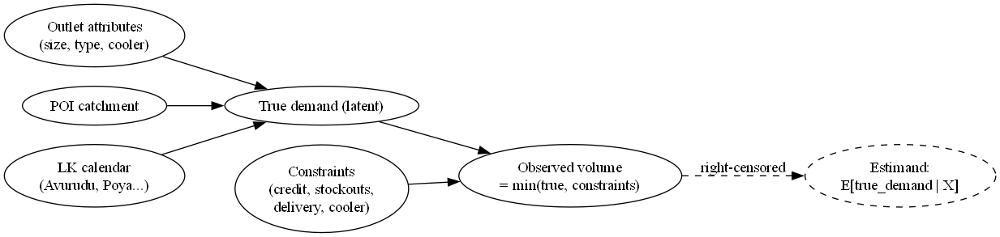

*Figure 1 — Bronze → Silver → Gold pipeline with the rejected-records quarantine store.*

### 1.2 POI acquisition: Geofabrik PBF ≫ naïve Overpass

Naïvely querying Overpass for $20{,}000 \times 9\text{ categories} \times 4\text{ radii} = 720{,}000$ requests is infeasible (timeouts + ToS violation). We instead download the **Geofabrik Sri Lanka country extract** (`sri-lanka-latest.osm.pbf`, ~136 MB) once, parse it locally with `pyrosm`, and run nearest-neighbour searches via `sklearn.neighbors.BallTree(metric="haversine")`. End-to-end: 25–45 min, entirely offline after a single fetch. The pipeline lives in `poi_pipeline/` as a separate, idempotent sub-project.

| Category | POIs | OSM tags |
| --- | --- | --- |
| Schools / universities | 5,694 | `amenity ∈ {school, university, college, kindergarten}` |
| Transport hubs | 5,799 | `highway=bus_stop`, `amenity=bus_station`, `railway=station` |
| Hospitals + healthcare | 2,007 | `amenity ∈ {hospital, clinic, pharmacy}`, `healthcare=*` |
| Restaurants / cafes | 4,667 | `amenity ∈ {restaurant, cafe, fast_food, food_court}` |
| Supermarkets / groceries | 2,543 | `shop ∈ {supermarket, convenience, grocery}` |
| Religious places | 9,255 | `amenity=place_of_worship` |
| Hotels / attractions | 5,513 | `tourism ∈ {hotel, guest_house, attraction}` |
| Offices | 4,169 | `office=*`, `amenity ∈ {townhall, post_office}` |
| Banks / ATMs | 2,739 | `amenity ∈ {bank, atm}` |
| **Total** | **42,386** | 80.9 % of outlets with ≥1 POI within 2 km |

*Table 1 — POI extraction summary (`poi_pipeline/data/pois/`).*

### 1.3 Features engineered to proxy footfall and market potential

**Spatial distance-decay (brief §2.1).** Rather than flat counts inside a radius, each of the 9 POI categories contributes a **Gaussian-decay catchment score** so that a bus stop 20 m away dominates one 400 m away:

$$\text{score}_{i,c} = \sum_{p \in c} \exp\!\left(-\frac{d(i,p)^2}{2\sigma_c^2}\right)$$

where $d(i,p)$ is the haversine distance from outlet $i$ to POI $p$ and $\sigma_c$ is a category-specific bandwidth. The nine category scores are z-averaged into a composite `poi_catchment_score`.

**Competitive catchment density (brief §2.2).** For every outlet we count other outlets within 500 m (`competitor_count_500m`) and within 1/2/5 km, plus `same_distributor_outlet_count_5km`, `nearest_outlet_distance_km`, and `cannibalisation_count_200m`. These are normalised into a `competitive_intensity` ∈ [0,1] signal distinguishing a crowded commercial cluster from an untapped rural market.

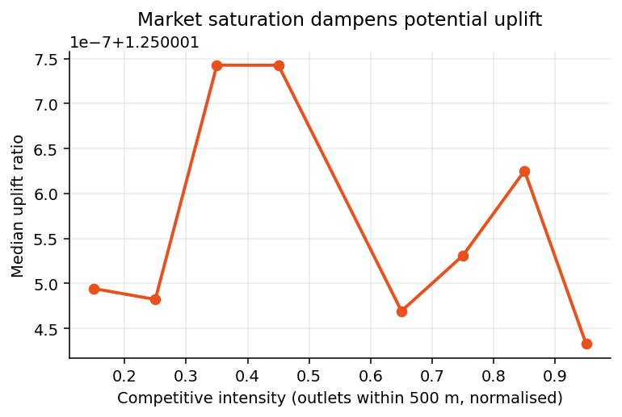

*Figure 2b — Outlets in denser competitive clusters show lower median uplift: market saturation is captured, not ignored.*

**Honest signal disclosure.** Our own EDA (notebook 23) found per-outlet POI counts correlate only weakly with monthly volume ($|r| \le 0.026$ across all `Outlet_Type` groups). POI therefore enters the model **only via the composite catchment score at ~20 % weight in the constraint score**, never as a standalone demand predictor — an OSM-LK mapping-bias caveat we disclose because small kades and roadside stalls (exactly our prediction targets) are under-mapped.

*Figure 2 — POI × Outlet_Type interaction: low absolute correlation confirms POI as a catchment signal, not a direct predictor.*

---

## 2. Data Cleaning

### 2.1 Initial data-quality assessment

The five raw datasets contained text artifacts from the source SFA/ERP system, out-of-country coordinates, non-positive transactions, and duplicate holidays. We assessed every dataset with the **same six parameterised check functions** — zero check is hardcoded for one table.

| Function (`checks.py`) | What it catches |
| --- | --- |
| `duplicate_check(df, key_columns)` | duplicate composite keys |
| `null_check(df, columns)` | NaN / empty mandatory fields |
| `range_check(df, column, min, max)` | numeric out-of-range |
| `domain_check(df, column, allowed_values)` | misspellings, unexpected enums |
| `referential_integrity_check(df, column, ref)` | foreign keys not in master |
| `geospatial_bounds_check(df, lat, lon, ...)` | coordinates outside Sri Lanka |

*Table 2 — All six DQ functions are parameterised and reused across all datasets.*

### 2.2 Programmatic cleaning steps and artifact neutralisation

| Artifact | Records | Action |
| --- | --- | --- |
| `Outlet_Type` typos (`Grocry`, `Bakry`) + `Outlet_Size` lowercase / missing | 1,581 | normalised / mapped to `Unknown` |
| Coordinates outside Sri Lanka (5.5–10°N, 79–82.5°E) | 240 | quarantined |
| Transactions with non-positive `Volume_Liters` / `Total_Bill_Value` | 9,606 | quarantined |
| Holiday duplicate (date + name + type) rows | 93 | deduped, originals to rejected |

*Table 3 — Every quarantined row carries a documented `failure_reason` (`src/cleaning/silver.py`).*

### 2.3 Capacity feature from a measured saturation knee

Volume *stops growing* after 3 coolers per outlet (notebook 23): median monthly volume at 3, 4 and 5+ coolers is statistically indistinguishable. We therefore use `Cooler_Count` as the deterministic sign anchor for the PCA capacity component in the constraint score — a physically-grounded representation of the cooler-replenishment ceiling the brief asks for.

*Figure 3 — Saturation knee at 3 coolers anchors the capacity feature.*

---

## 3. The Mathematical Framework

### 3.1 Identification: right-censored, not point-identified

The estimand $\mathbb{E}[\text{true\_demand}_i \mid X_i]$ is **not point-identified** from observational data alone (no exogenous variation in constraints). Observed $y_i = \min(\text{true\_demand}_i, \text{constraint}_i)$ is right-censored — for any constrained outlet we see only a lower bound. We embrace this and report a **band** alongside the point.

*Figure 4 — Causal DAG: observed sales are the min of latent demand and constraint; the estimand is only partially identified.*

For 15.62 % of outlets the q90 frontier lies *below* the observed historical maximum; without a `max(·, observed_max)` floor, validation check V3b fails for those rows.

*Figure 5 — Negative frontier-gap values motivate the floor at `observed_max`.*

### 3.2 Method stack

**Robust lower bound + frontier ensemble.**
$$\text{lower}_i = \max(\text{3rd-highest month}_i,\ \text{median}_i)$$
The frontier $F_i$ is a 60/40 blend of (a) **XGBoost 2.0** with `reg:quantileerror`, `quantile_alpha=[0.5,0.75,0.9,0.95]`, monotone constraints + isotonic post-sort, and (b) **SFA**: $y = X\beta + v - u$ with truncated-normal $u$, direct MLE; per-outlet technical efficiency $\text{TE} = \exp(-\mathbb{E}[u\mid\varepsilon])$ (fitted $\sigma_v \approx 0.41$, $\sigma_u \approx 0.78$, $\lambda \approx 1.92$; median TE ≈ 0.84). Leaky `observed_*` aggregates are dropped from the SFA design matrix.

**Censoring correction + constraint score.** Chernozhukov–Hong (2002) 3-step: a propensity $P(\text{censored}\mid X)$ is fit on plateau / stuck-at-ceiling proxies, then q90 is refit on $P < 0.10$. (Only 1.16 % of outlets show a true plateau fingerprint globally — CH-3 is a small-population correction, not load-bearing.) The constraint score $s_i \in [0,1]$ combines three **orthogonal** signals: peer-q90 frontier residual z-score, plateau gate, and PCA-decorrelated capacity.

**Final formula + calibrated interval.**
$$\text{potential}_i = \max\!\Big(\text{obs\_max}_i,\ \text{lower}_i + s_i (F_i - \text{lower}_i),\ \mathbf{1}_{[s_i \ge 0.4]} \cdot 1.25 \cdot \text{obs\_max}_i\Big),\ \text{capped at } B_i \cdot \text{obs\_max}_i$$
where $B_i$ is the empirical 95th-percentile uplift inside outlet $i$'s (`Outlet_Type` × `Outlet_Size`) bucket. We additionally report a calibrated $[q_{05}, q_{95}]$ via **Conformalised QR** on a 20 % outlet-level holdout, plus **Manski** worst-case bounds per outlet.

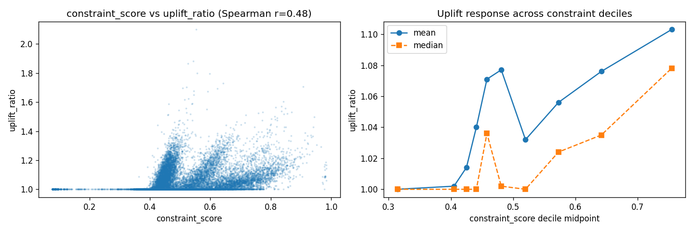

*Figure 6 — Constraint score drives the per-outlet uplift; capped by bucket-specific evidence.*

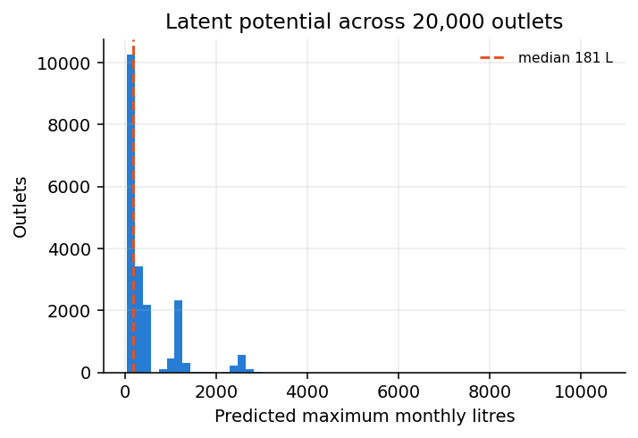

*Figure 6b — Predicted maximum monthly litres across all 20,000 outlets.*

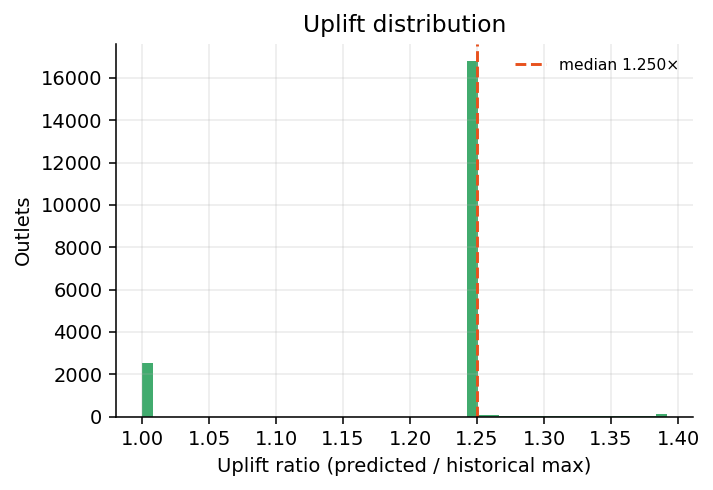

*Figure 6c — Uplift ratio (predicted ÷ historical max); median 1.250×, no implausible long tail.*

---

## 4. Spend Optimization Logic

### 4.1 Problem

Distribute a fixed **LKR 5,000,000** Western-Province promotional budget across the **9,000** Western outlets (`DIST_W_01/02/03`) to **maximise additional sales volume** over the normal historical baseline, with total spend ≤ budget. Western holds the largest untapped headroom of the four provinces, making it the natural focus for the pilot.

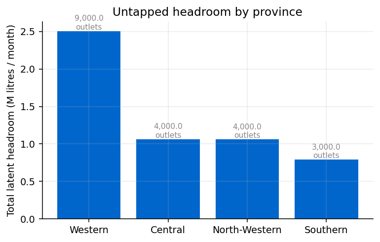

*Figure 6d — Total latent headroom by province; Western (9,000 outlets) carries the most untapped volume.*

### 4.2 Response model (concave, saturating returns)

Incremental litres from spend $s$ at outlet $i$:
$$g_i(s) = H_i \left(1 - e^{-s/k_i}\right)$$
where $H_i$ is the outlet's latent **headroom** (predicted potential − normal baseline) and the responsiveness scale $k_i$ grows with the opportunity's revenue value and local competitive intensity:
$$k_i = \alpha \cdot (H_i \cdot \text{bill\_per\_litre}_i) \cdot (1 + \beta \cdot \text{competitive\_intensity}_i)$$
A revenue-anchored per-outlet cap $\text{cap\_frac} \cdot H_i \cdot \text{bill\_per\_litre}_i$ prevents a few large outlets from absorbing the whole budget. Defaults: $\alpha=0.15$, $\beta=0.50$, `cap_frac`=0.35, `min_spend`=LKR 250.

### 4.3 Exact solution via Lagrangian water-filling (KKT)

Because the objective $\sum_i g_i(s_i)$ is **separable and concave**, the optimum is exact, not heuristic. The Lagrangian
$$\mathcal{L} = \sum_i g_i(s_i) - \lambda\left(\sum_i s_i - B\right)$$
gives the stationarity (KKT) condition $g_i'(s_i^\star) = \lambda$ for funded outlets. With $g_i'(s) = \tfrac{H_i}{k_i} e^{-s/k_i}$, each outlet's spend is closed-form in the shadow price $\lambda$:
$$s_i^\star(\lambda) = \Big[\, k_i \ln\!\big(\tfrac{H_i}{k_i \lambda}\big) \,\Big]_{0}^{\text{cap}_i}$$
We **bisect on $\lambda$** until $\sum_i s_i^\star(\lambda) = B$. Outlets whose marginal return at zero spend is below $\lambda$ receive nothing; the rest are funded up to their cap. This is provably budget-feasible and optimal.

### 4.4 Result (Western Province, LKR 5M, January 2026)

| Metric | Value |
| --- | --- |
| Budget utilisation | 98.0 % (LKR 4,901,675) |
| Outlets funded | 3,729 / 9,000 |
| Expected incremental volume | **+109,021 L** |
| Expected incremental revenue | LKR 27.08 M |
| Litres per LKR 1,000 spend (blended) | 21.8 L |
| Revenue-to-spend ROI | **5.53×** |

*Table 4 — `Results/budget_allocation_summary.json`. Submission: `Results/smile_labs_budget_allocations.csv` (`Outlet_ID`, `Trade_Spend_Allocation_LKR`).*

The allocation concentrates spend on **high-headroom, high-margin, moderately-competitive** outlets — those with the most untapped potential per rupee — rather than rewarding historical top sellers (which are already near their ceiling) or starving genuinely isolated shops.

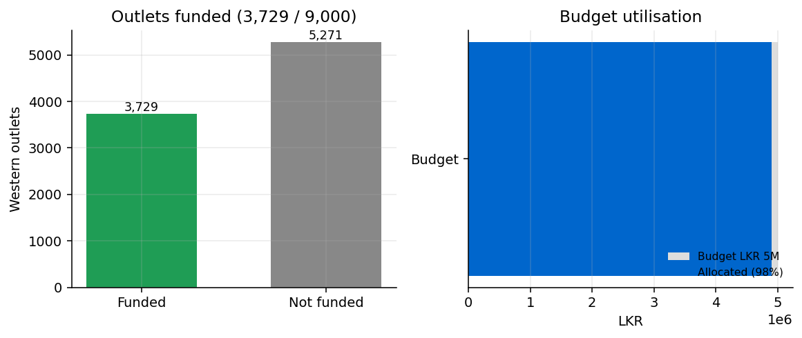

*Figure 7 — 3,729 of 9,000 Western outlets funded, absorbing 98 % of the LKR 5M budget.*

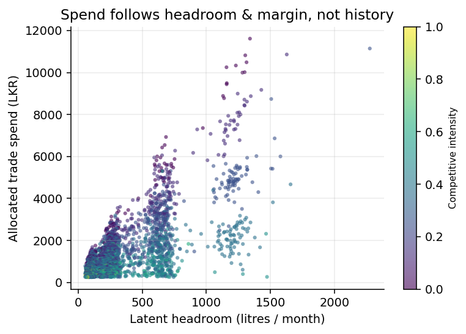

*Figure 8 — Spend tracks latent headroom and margin (KKT water-filling), modulated by competitive intensity.*

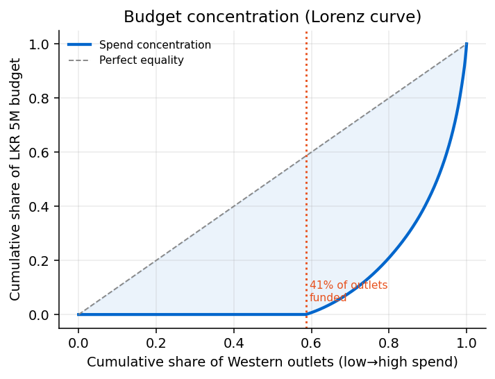

*Figure 9 — Lorenz curve: the concave-response optimum deliberately concentrates budget on the highest-return outlets rather than spreading thinly.*

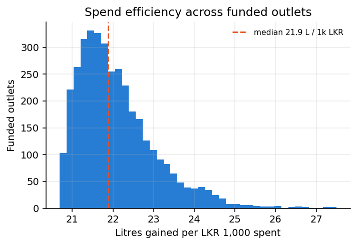

*Figure 10 — Distribution of litres gained per LKR 1,000 across funded outlets.*

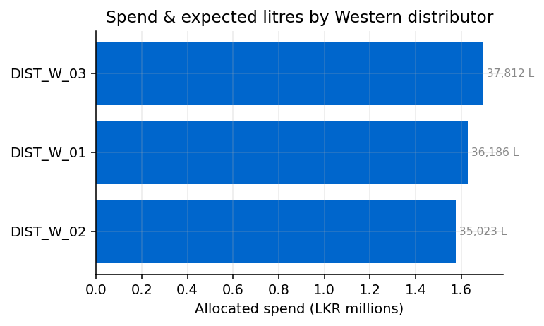

*Figure 11 — Allocated spend and expected incremental litres by Western distributor.*

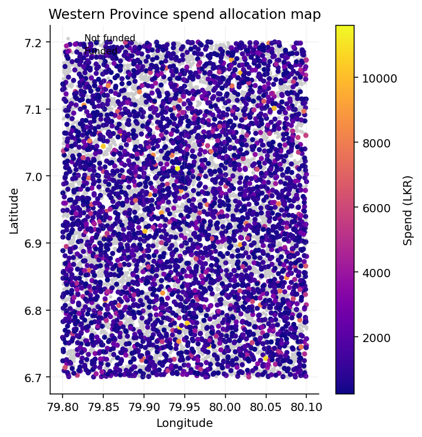

*Figure 12 — Geographic distribution of the Western-Province allocation (funded outlets coloured by spend).*

---

## 5. Functional Explainable AI (XAI)

The XAI module (`src/xai/`) is a **user-facing layer** embedded in the web app, in two stages mapped to the four signal groups the brief requires.

1. **`drivers.py` — signed driver payload.** Converts a prediction into a ranked, signed set of drivers: *model drivers* (latent headroom, best-month anchor, sales-history depth), *local environment signals* (competitive catchment density, POI intensity), and *operational constraints* (cooler capacity vs the outlet-size norm). Each driver carries a direction (increases / decreases / neutral), a relative weight, and a one-line technical detail.

2. **`narrative.py` — LLM narrative.** An LLM translates the structured payload into plain business language answering *why this score, which factors pushed it up or down, and how local conditions and constraints shaped it*. It uses the **Anthropic API** (`claude-opus-4-8`) when `ANTHROPIC_API_KEY` is set, with a deterministic **offline template fallback** so the app always produces a grounded explanation. Both paths consume the same payload, so narratives are never free-floating — they are validated against the structured drivers. Sample outputs: `Results/xai_samples.json`.

---

## 6. Validation, Outputs & Web App

### 6.1 Validation without ground truth (6-item auto-checklist)

| # | Check | Detail (final run) | Status |
| --- | --- | --- | --- |
| V1 | schema + row count | `[Outlet_ID, Maximum_Monthly_Liters]`, 20,000 rows | OK |
| V2 | no NaN / negatives, unique IDs | NaN=0, neg=0, unique=True | OK |
| V3a | every Outlet_ID in outlet_master | missing = 0 | OK |
| V3b | predicted ≥ historical max for ≥99 % | 0.00 % below historical max | OK |
| V4 | median uplift ∈ [1.25, 2.2] | median = 1.250 | OK |
| V5 | cap-binding rate < 25 % | 0.00 % at cap | OK |

*Table 5 — `src/reporting/validation.py` → `Results/validation_report.md`. Sensitivity sweep across quantile × scheme × cap keeps median uplift at 1.250× and cap-binding at 0 %.*

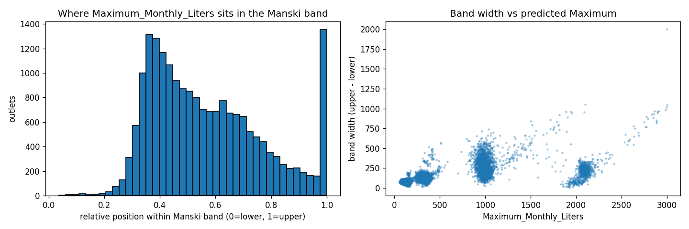

*Figure 7 — Per-outlet Manski band: where the submitted point sits between the worst-case lower and upper bounds.*

### 6.2 Outlet Intelligence web app

A local **Streamlit** app (`app/streamlit_app.py`, no external services) with three tabs satisfying brief deliverable #4: **Browse** (every outlet; filter by province / distributor / outlet type, search by ID, map, CSV export), **Drill-down** (per-outlet metrics, the signed driver list, an on-demand XAI narrative with live/offline toggle, and the raw payload), and **Western spend plan** (the LKR 5M allocation with utilisation, funded count, expected uplift, and submission download).

---

## 7. GenAI Transparency Log

| Phase | AI usage | Human validation applied |
| --- | --- | --- |
| Research swarm | 10-channel parallel research swarm producing `research/research_brief.md` | each claim cross-checked against cited URLs |
| Methodology audit | Seven rounds of 4–5 parallel critics (Statistician, Skeptic, Architect, Safety+DE, Gap, Visual, Judge, Risk) | every finding cites `file:line`; verified or rebutted manually |
| Code + design | LLM-assisted JLMS closed form; OSM tag survey; Geofabrik vs Overpass trade-off; spend-optimizer KKT derivation | syntax + import checks; SFA cross-checked vs Greene; optimizer verified budget-feasible & concave |
| XAI integration | LLM narrative prompt engineering; driver payload schema design | narratives validated against structured drivers; offline fallback tested |
| Report drafting | LaTeX assembly + content port from markdown source | every claim traced to an artifact in `Results/` or `data/gold/` |

*Table 6 — Per-phase GenAI transparency. Full log: `Docs/ai_transparency_log.md` (R1–R7 audit trail).*

---

## Deliverables

| Artifact | Path |
| --- | --- |
| Platform predictions CSV | `Results/smile_labs_predictions.csv` (20,000 rows) |
| Budget allocations CSV | `Results/smile_labs_budget_allocations.csv` (Western, LKR 5M) |
| Manski + conformal bands | `Results/manski_bands_v2.csv`, `conformal_intervals_v2.csv` |
| Validation | `Results/validation_report.md` (6/6 PASS) |
| Outlet Intelligence app | `app/streamlit_app.py` |
| Reproducible codebase | `run_pipeline.py` + `run_final_round.py`; modules in `src/` |

## References

1. C. F. Manski. *Partial Identification of Probability Distributions.* Springer, 2003.
2. D. Aigner, C. A. K. Lovell, P. Schmidt. "Formulation and Estimation of Stochastic Frontier Production Function Models." *J. Econometrics* 6.1 (1977).
3. J. Jondrow, C. A. K. Lovell, I. S. Materov, P. Schmidt. "On the Estimation of Technical Inefficiency in the Stochastic Frontier Production Function Model." *J. Econometrics* 19.2–3 (1982).
4. V. Chernozhukov, H. Hong. "Three-Step Censored Quantile Regression and Extramarital Affairs." *JASA* 97.459 (2002).
5. Y. Romano, E. Patterson, E. J. Candès. "Conformalized Quantile Regression." *NeurIPS* 32 (2019).
6. Geofabrik GmbH. *OpenStreetMap Data Extracts — Sri Lanka.* Accessed January 2026.
7. T. Chen, C. Guestrin. "XGBoost: A Scalable Tree Boosting System." *KDD '16* (2016).
8. V. Chernozhukov, I. Fernández-Val, A. Galichon. "Quantile and Probability Curves Without Crossing." *Econometrica* 78.3 (2010).
9. J. L. Powell. "Censored Regression Quantiles." *J. Econometrics* 32.1 (1986).
