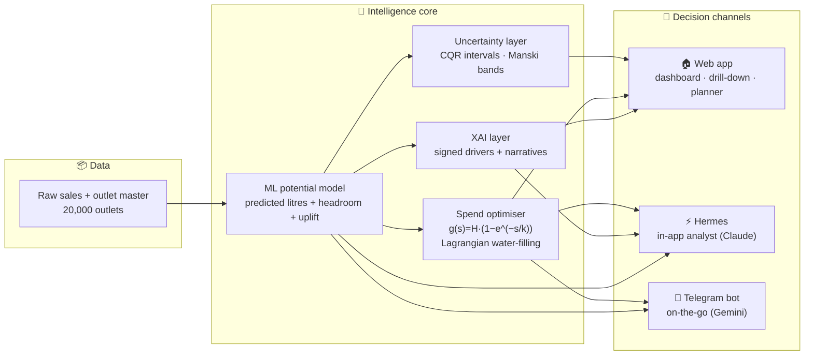

# Outlet Intelligence — System Architecture

One model, rigorously validated, feeding three decision channels.

## The pipeline in four steps

| Stage | What it does | Proof it works |
| --- | --- | --- |
| **1 · Predict** | ML model estimates each outlet's monthly purchase *potential*, floored at its proven historical best. | 6/6 pre-flight validation checks pass; 0% below historical max. |
| **2 · Quantify uncertainty** | Conformalised quantile-regression (CQR) prediction intervals + Manski partial-identification bounds. | 99.98% of point estimates fall inside their worst-case bands. |
| **3 · Optimise spend** | Saturating response model solved by Lagrangian water-filling allocates LKR 5M across Western outlets. | Diminishing returns modelled explicitly, not assumed. |
| **4 · Explain & deliver** | Signed drivers + LLM narratives, served through three channels. | Every recommendation is traceable to named drivers. |

## Headline result

> **LKR 4.9M optimised spend → 109,021 L incremental volume → ≈ LKR 27.1M revenue → 5.5× return.**
